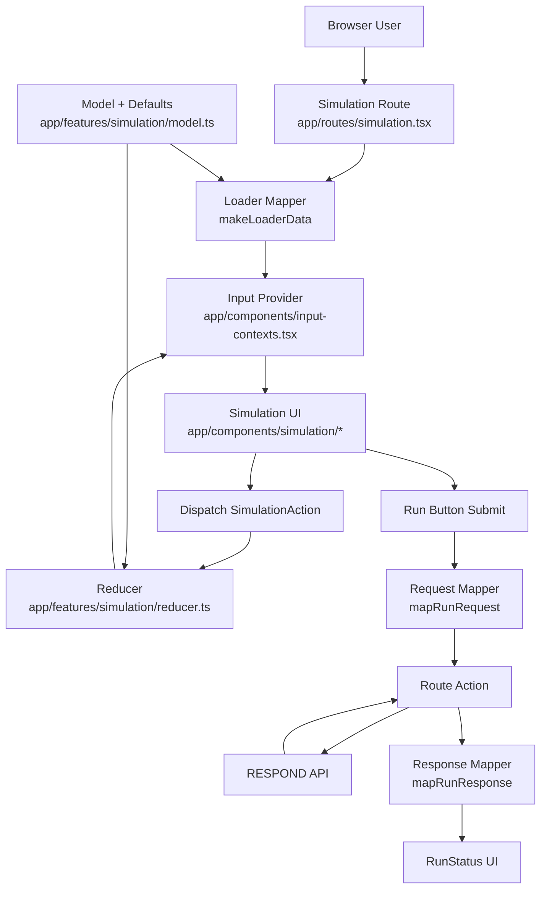
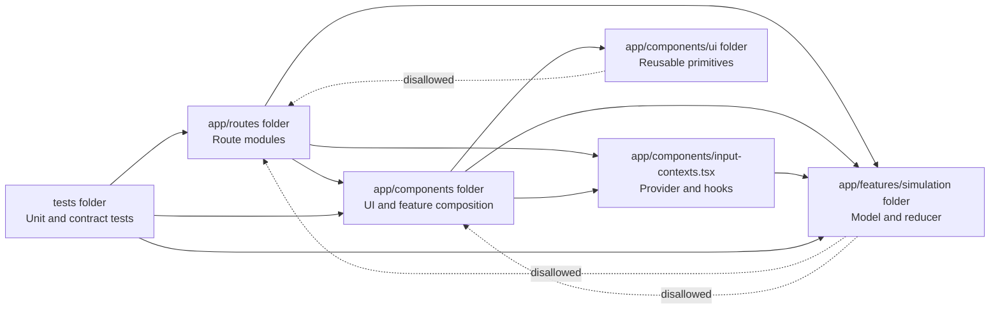

# RESPOND Web App

[Website](https://respond.syndemicslab.org)

A web interface for the [RESPOND](https://github.com/SyndemicsLab/respond) simulation model.

Per section C.4.4 of the HEAL D2A Modeling and Economic Resource Center (MERC) grant proposal:

> **C.4.4 Development of the interface** The RESPOND meta-model will be the engine underneath a web-based interface that Innovation Project teams can use to evaluate where existing interventions can have maximal impact with available resources, or to set priorities for implementing new interventions. The interface will be accessible through the web portal established and maintained by the RASC. We will hold a series of interviews with Innovation Project teams to identify feasible inputs, target outcomes, and the design of the interface. We will identify model input parameters for which they expect to have local data, as well as parameters for which they likely will not have easily accessible estimates but the interface could provide an acceptable range of values from which to select based on data from other locations and/or model calibrations. To select outcomes, we will review with interviewees relevant results of the needs assessment (C.2.7.1) and query them about the ways that they might use the interface. We will also explore the best way to frame outcomes for decision-making. [...] We will also work with the DISC to develop compelling data visualizations that are easy to interpret and useful for stakeholders. Working with Dr. Benda, our human factors expert, we will then develop alpha versions (or mock-ups) of the interface and conduct additional interviews with potential users to select options for further development and release. We will work with Dr. Benda to evaluate interface use annually and conduct user interviews focusing on barriers and facilitators to using the interface.

## Codebase Structure (Maintainability Guide)

This project uses React Router v7 Framework Mode route modules and a feature-first organization for simulation logic.

### Top-level directories

- `app/`: application source code.
- `app/routes/`: route modules (`home`, `contact`, `respond`, `simulation`, `glossary`).
- `app/components/`: reusable UI and page/feature components.
- `app/features/`: feature-domain logic that should stay framework-light.
- `tests/`: route and feature contract/unit tests.
- `data/images/`: static image assets used by the app.

### Core architecture boundaries

#### 1. Route boundary (I/O and orchestration)

`app/routes/simulation.tsx` owns:

- loader and action boundaries,
- request/response mapping to backend,
- route-level provider wiring,
- run status UI (`pending`, `success`, `error`).

Guideline: keep API calls and route contracts here, not inside low-level components.

#### 2. Feature domain boundary (pure model + reducer)

`app/features/simulation/model.ts` and `app/features/simulation/reducer.ts` own:

- canonical simulation types,
- default input data,
- pure state transition helpers,
- typed reducer actions.

Guideline: domain logic should remain pure and testable with no direct router or DOM dependencies.

#### 3. UI boundary (presentational + interaction components)

`app/components/simulation/**` and `app/components/ui/**` own:

- rendering inputs/controls,
- dispatching typed actions,
- view composition and styling,
- data visualization components.

Guideline: UI components should consume typed props/context and avoid business rules when possible.

### Simulation feature map

- State context/provider: `app/components/input-contexts.tsx`
- Reducer + helper logic: `app/features/simulation/reducer.ts`
- Domain model/defaults: `app/features/simulation/model.ts`
- Route contract + submission flow: `app/routes/simulation.tsx`
- Intervention subcomponents: `app/components/simulation/interventions/*`
- Chart components: `app/components/simulation/viz/*`

### Architecture diagram

Data flow summary:

1. The route loader obtains defaults and maps them into initial editable inputs plus presets.
2. The provider holds route-scoped simulation state.
3. UI components dispatch typed actions to a pure reducer.
4. Submitting RUN sends mapped JSON through the route action to the backend API.
5. The action maps backend responses into a typed UI status contract.

### Dependency direction diagram

This diagram shows preferred import direction across folders/modules.

Import boundary rules:

1. Routes may import from components and features.
2. Components may import from features and UI primitives.
3. Features should stay framework-light and must not depend on routes/components.
4. UI primitives should not import route modules.
5. Tests can depend on any module under test, but production code should follow the one-way dependency flow above.

### Testing strategy

- `tests/simulation/reducer.test.ts`: unit tests for pure reducer/helper behavior.
- `tests/routes/simulation.contract.test.tsx`: route contract tests for loader/action/request/response and run status rendering.
- `tests/routes/*.test.tsx`: route smoke tests.

When adding behavior, prefer:

1. pure helper unit tests for domain changes,
2. route contract tests for API boundary changes,
3. minimal component tests only where rendering logic is non-trivial.

### Legacy compatibility note

`app/data.ts` currently acts as a compatibility re-export to `app/features/simulation/model.ts`. New code should import directly from `app/features/simulation/model.ts` unless a backward-compatible alias is specifically needed.

### Where to put new code

- New domain concepts/types/defaults: `app/features/<feature>/model.ts`
- New pure state transitions: `app/features/<feature>/reducer.ts`
- New route boundary behavior (loader/action mapping): `app/routes/<route>.tsx`
- New reusable UI controls: `app/components/ui/*`
- New simulation-specific UI: `app/components/simulation/*`
- New tests for domain logic: `tests/<feature>/*`
- New tests for route contracts: `tests/routes/*`

### Practical conventions

- Prefer explicit TypeScript types at boundaries (route responses, reducer actions, component props).
- Keep reducer actions discriminated and narrow.
- Avoid mutating state in reducers/helpers.
- Keep API payload shaping in mapper functions near route boundaries.
- Keep chart code typed (avoid `@ts-nocheck`) and handle empty datasets defensively.
